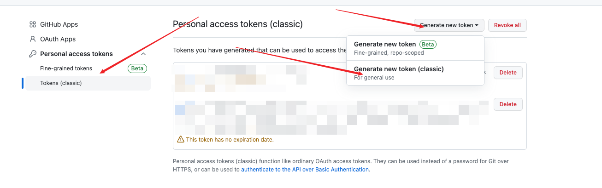
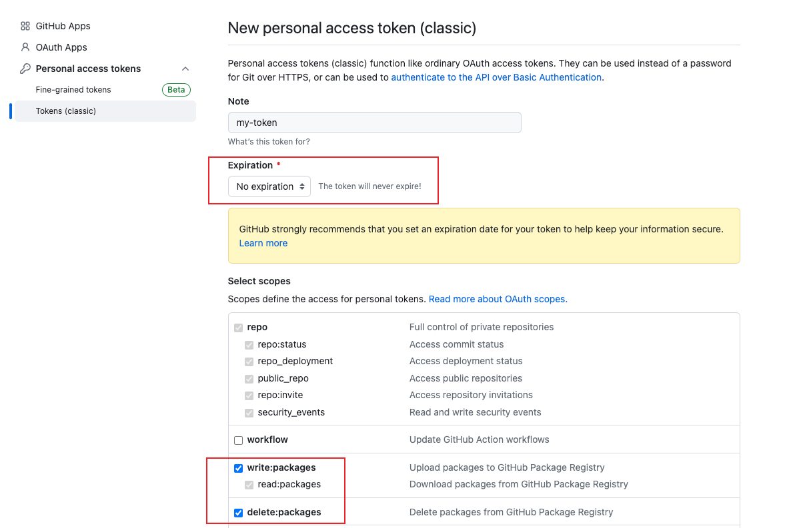

# 介绍

Cloud-backup 可以帮助你将一些重要文件备份在 github 仓库。

# 前提

[注册 Token](#token)

# 如何使用

## 方式1: 使用 Docker

保存下面文件为 `docker-compose.yaml`, 修改启动参数为你自己的, 使用命令 `docker compose up -d` 启动容器。

```dockerfile
version: '3'
services:
  myservice:
    container_name: cloud-backup
    image: oldwang6/cloud-backup:latest
    command:
    - /root/cloud-backup
    # 注册地址: https://github.com/settings/tokens/new
    # 建议注册一个没有期限的Token，需要开启 读、写权限。
    - --token=<Github Token>
    # 你的 github 用户名，例如：oldwang12
    - --owner=<username>
    # 你要备份到 github 哪个仓库
    - --repo=<Your Repo>
    # 你要备份到仓库哪个分支。（分支不存在会失败）
    - --branch=<Your Branch>
    # 多久执行备份一次，单位 hour
    - -t=24 
    # 备份时，默认会对文件加上此前缀。
    - -s=备份前缀
    # 挂载路径
    volumes:
    - type: bind
      # 本地文件、文件夹路径
      source: /local/backup_file
      # 容器内文件、文件夹路径。注意这里的路径必须为 /root 开头，程序会自动备份 /root 下的所有文件。
      target: /root/backup_file
```

## 方式2: 使用 kubernetes

如果你还不了解什么是 kubernetes ，建议使用 方式1

保存下面文件为 `deployment.yaml`, 修改启动参数为你自己的, 使用命令 `kubectl apply -f deployment.yaml`。

```sh
apiVersion: apps/v1
kind: Deployment
metadata:
  name: cloud-backup
spec:
  replicas: 1
  selector:
    matchLabels:
      app: cloud-backup
  template:
    metadata:
      labels:
        app: cloud-backup
    spec:
      containers:
        - name: myservice
          image: oldwang6/cloud-backup:latest
          command:
            - /root/cloud-backup
            - --token=<Github Token>
            - --owner=<username>
            - --repo=<Your Repo>
            - --branch=<Your Branch>
            - -t=24
            - -s=备份前缀
          volumeMounts:
            - name: backup-volume
              mountPath: /root/backup_file
      volumes:
        - name: backup-volume
          hostPath:
            path: /path/backup_file
```

# 注意

* 需要备份的文件必须挂载到容器 /root 下。
* 文件夹会压缩为 tar.gz 后上传至 github。
  
<p id="token"></p>

# Token 注册

访问地址： https://github.com/settings/tokens/new

## 步骤一
()

## 步骤二
()